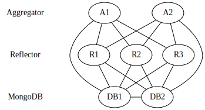

= Backend
:toc:

== Topology
Since all clients must maintain the exact same state, messages must be delivered in-order.
To facilitate this, the backend servers are sharded by guild, allowing each server to maintain the exact order of messages for their guilds.
However, clients generally participate in multiple guilds, necessitating a layer which routes the connections on a per-guild basis.
These layers are detailed in the below diagram. The layers are connected using msgpack over websockets.

=== Aggregator
The aggregator is responsible for terminating websocket connections, implementing the <<_protocol>>, as well as authentication and authorization.
When an event arrives that needs to be processed by a reflector (e.g. Data event), the aggregator looks up the appropriate reflector in the DB, and opens a connection to the reflector, if one does not already exist.
If no reflector exists for a guild, one will be allocated, based on the load information in the database

Importantly, when a client subscribes to a guild, the event is relayed to the appropriate reflector, so it knows to send any events for that guild back to that aggregator.
Connections to reflectors are kept open with periodic hearbeats so they can be reused.

=== Reflector
The reflector is responsible for the ordering of messages on a per-guild basis.
It maintains a queue of events for each guild.
When it receives a event on one of these queues, it stores the event in the database, and sends the event to the subscribed aggregators.
The reflector never creates connections, instead sending messages through existing connections created by aggregators.

[#auth]
== Authentication & Authorization
Users are authenticated using a token known only to that user.
Tokens are arbitrary length byte sequences (currently 16 random bytes).

Each user has an allowlist for each guild, which dictates who they will receive messages from.
User's can only edit their own allowlist.
The OR of all users' allowlists for a guild dictates whether a user's message will be stored by the backend, and whether they can subscribe to the guild.

When a user with the correct permissions decides to remove a user, (if the message is valid) each user in the guild removes the user from their guild allowlist.
This immediately blocks the offending user from wasting a user's bandwidth with bogus messages.
However, since not all users are online, the offending user may still be on other user's allowlists, allowing them to waste the storage of the backend.
This is not a significant issue however, as the backend must already ratelimit events to prevent normal denial of service attacks.
Once all users come online once, the user will be removed from all guild allowlists, blocking them from listening to or sending events.

If a user tries to maliciously block another user, they won't get very far, as the message to block the user will be rejected by other users in the guild, and the user will remain on their allowlists.

Futher, we don't need to enforce the consistency between the user id for each connection, and the messages that connection sends.
If users receive messages from a random uuid, they will simply drop them.
Since the original user uuid was already authorized, this does not break the authorization system.

== Database
More information can be found in `backend/common/db.go`

All encrypted messages are stored in MongoDB.
The messages are stored in chronological order per guild indexed by timestamp.
Internally, we have a `messages` collection in the `carbide` database.

Each guild also has a document in the `guilds` collection describing which reflector it is currently being served by, as well as each user's allowlist.
Reflectors also have their own `reflectors` collection, allowing them to share their current load with aggregators.

The `users` collection contains information about the token and user ID of each user.

== Protocol
The webapp talks to the backend over websockets using msgpack.
More documentation, and the source of truth for event formats, is availabe in `backend/aggregator/event.go`.

Events are sent as `websocket.BinaryMessage`, as the underlying encrypted messages are, of course, binary.

The same protocol is reused for communication interally in the backend, although only a limited subeset of events are used.
Aggregators are still required to respond to heartbeats from reflectors, and should close the connection if twice the interval elapses.
